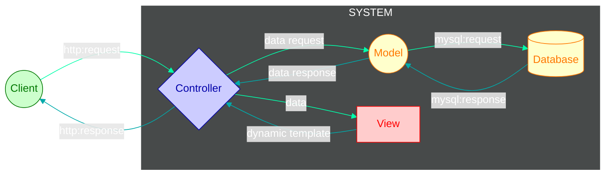
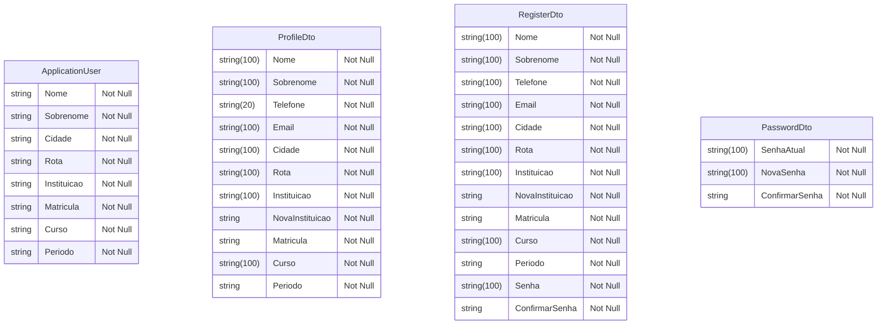
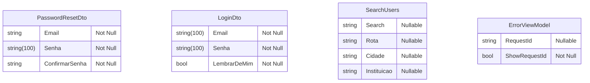
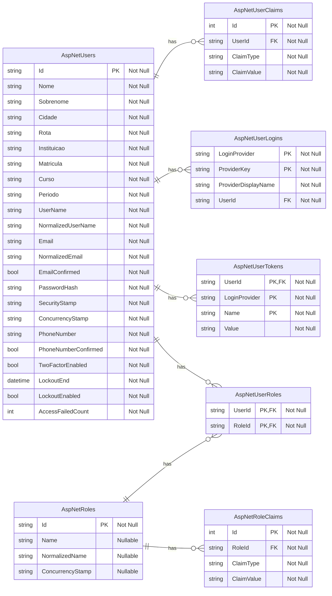

<h1 align="center">
   
</h1>

Com o objetivo de unificar e simplificar todo o processo de organização do transporte entre cidades e centros de ensino, o Campus Connect surge como alternativa tecnlogia para um problema que - até então - era resolvido de forma não muito tecnologica assim...

<!--  -->
<!--  -->

## Stack

<!-- Front -->

<!-- Back/Framework -->

<!-- Server -->

<!-- DB Engine -->

<!-- Testing Stuff -->

<!--  -->
<!--  -->
<!--  -->
<!--  -->
<!--  -->

<!-- Host -->

<!--  -->
<!--  -->
<!--  -->
<!--  -->
<!--  -->
<!--  -->

<!-- Misc -->

<!--  -->
<!--  -->
<!--  -->
<!--  -->
<!--  -->

<!-- CI/CD -->

<!--  -->
<!--  -->

## Arquitetura

Campus Connect é uma aplicação web desenvolvida para facilitar a gestão e integração de estudantes universitários que utilizam o transporte intermunicipal para instituições de ensino. O sistema centraliza informações de alunos de três cidades distintas, cruzando dados com rotas e linhas de transporte, a fim de otimizar a organização logística e o uso dos recursos disponíveis.

O projeto visa resolver desafios comuns enfrentados por estudantes que dependem de transporte coletivo entre cidades para frequentar suas aulas. Ao integrar dados de alunos, rotas e instituições, o Campus Connect fornece uma base sólida para gestores de transporte estudantil tomarem decisões mais eficientes, ao mesmo tempo em que oferece aos alunos uma experiência mais transparente e organizada.

### Estrutura MVC - ASP.Net Core

### Models

### DB Relations

## Execução

Antes de iniciar com o desenvolvimento e os comandos, é importante definir as variáveis de ambiente no seu ambiente de desenvolvimento. Abaixo a listagem de quais definir:

| Variável  | Tipo     | Necessidade            | Default | Descrição                  |
| :-------- | :------- | :--------------------- | :------ | :------------------------- |
| `EXAMPLE` | `string` | [Required \| Optional] | `Foo`   | Lorem ipsum dolor sit amet |

### Ação

`comando`

<!--
LISTA DE POSSÍVEIS AÇÕES

Linter
Checagem de Tipos
Conversão (e.g. TS -> JS)
Buscar/iniciar Migrações (Atualizações) de Banco de Dados
Atualizar Estrutura do Banco de Dados com Novas Migrações
Iniciar Testes Automatizados
Popular Banco de Dados para Execução Local
Iniciar o Servidor
 -->

<!-- ## To-Do List

- [ ] Lista
- [ ] de
- [ ] Tarefas -->

## Licença

This project is under [MIT - Massachusetts Institute of Technology](https://choosealicense.com/licenses/mit/). A short and simple permissive license with conditions only requiring preservation of copyright and license notices. Licensed works, modifications, and larger works may be distributed under different terms and without source code.
